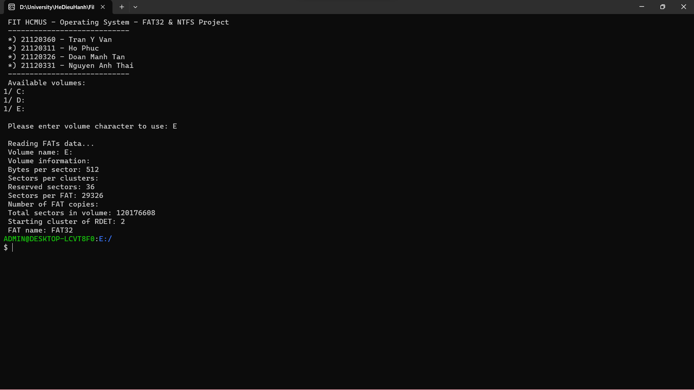
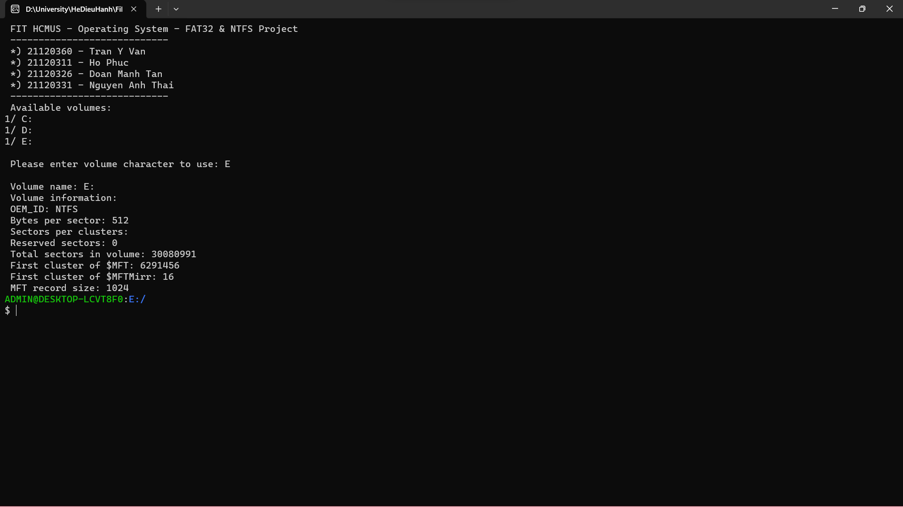
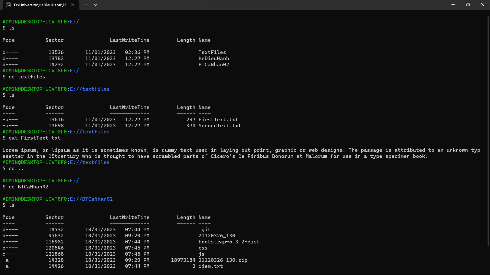
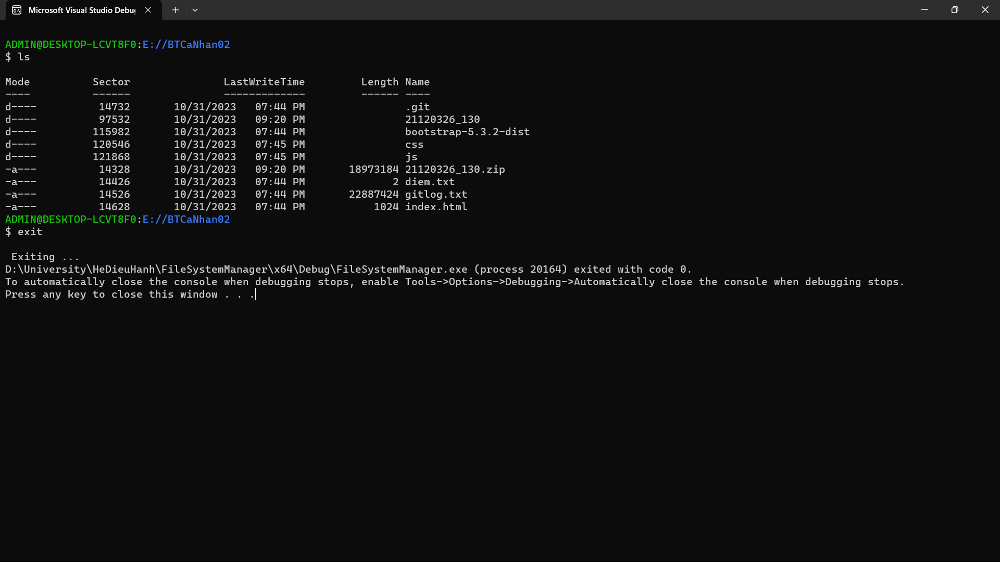
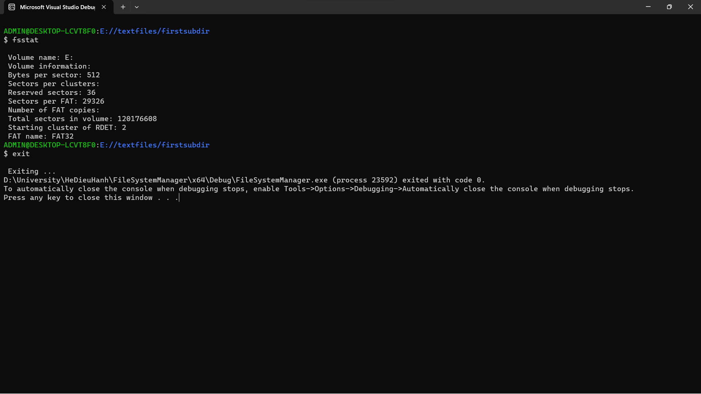

# FAT32-NTFS-Explorer
HCMUS - 21_3 - Operating System Project

GV: **Lê Viết Long**
## Thành viên: 
- 21120360 - Trần Ý Văn - **Nhóm trưởng**
- 21120311 - Hồ Phúc
- 21120326 - Đoàn Mạnh Tân
- 21120331 - Nguyễn Anh Thái
## Mô tả: 
Đồ án là một ứng dụng viết bằng C/C++ mô phỏng một linux terminal để truy cập vào hệ thống quản lý tập tin FAT32 và NTFS.  
Ứng dụng thực hiện các chức năng cơ bản sau: 
* **ls**: liệt kê các Files và Folders con
* **cd**: chuyển đổi thư mục
* **cat**: in nội dung tập tin (chỉ áp dụng cho file text)
* **clear**: clear màn hình
* **fsstat**: hiện thị thông tin về hệ thống quản lý tập tin
## Cách sử dụng:
Clone project về, mở lên và chạy bằng visual studio hoặc chạy file exe. (Sử dụng USB drive để test ứng dụng).  
Nếu test trên Local Drive (C, D) thì mở visual studio và chạy với quyền admin. (Khuyến cáo test trên Volume có dung lượng vừa phải)
## Demo
### Intro
**FAT32**

**NTFS**

### Một số chức năng cơ bản
*Áp dụng cho cả FAT32 và NTFS*

